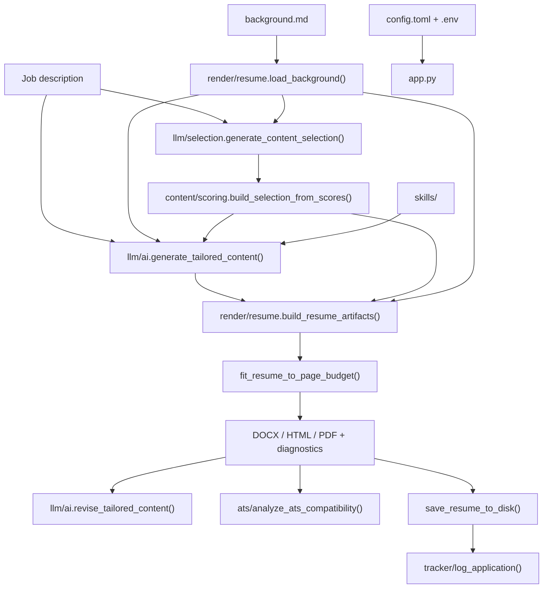

# Architecture

Resume Tune is a local Streamlit app that tailors resume summary and skills via an OpenAI-compatible LLM, selects job-relevant bullets from `background.md`, renders DOCX/HTML/PDF, and optionally runs ATS checks.

## End-to-end pipeline



## Package layout

Code lives under `src/resume_tune/`. The Streamlit entry point stays at repo root as [`app.py`](../app.py).

| Path | Responsibility |
|------|----------------|
| [`app.py`](../app.py) | Streamlit UI, session state, wires everything |
| [`settings.py`](../src/resume_tune/settings.py) | Load `.env` + `config.toml`, validate sections |
| [`llm/ai.py`](../src/resume_tune/llm/ai.py) | LLM calls, JSON parse/validate, summary/skills generation & revision |
| [`llm/selection.py`](../src/resume_tune/llm/selection.py) | LLM content ratings (1–5), apply selection to background |
| [`content/scoring.py`](../src/resume_tune/content/scoring.py) | Composite scores, build/trim/expand selection (pure logic, no LLM) |
| [`skills/skills_map.py`](../src/resume_tune/skills/skills_map.py) | Load/validate allowed skills from background |
| [`skills/skills_selection.py`](../src/resume_tune/skills/skills_selection.py) | Job-relevant skill scoring and line packing |
| [`render/resume.py`](../src/resume_tune/render/resume.py) | Parse background, DOCX/HTML/PDF, page fitting |
| [`ats/ats.py`](../src/resume_tune/ats/ats.py) | Deterministic ATS keyword/section/contact checks |
| [`tracker/tracker.py`](../src/resume_tune/tracker/tracker.py) | Application log spreadsheet |

## Layer rules

- **`content/`** — Pure policy math. No LLM or file I/O.
- **`llm/`** — All OpenAI-compatible API calls. Two distinct call sites:
  1. `selection.py` — rate every experience/project/education item 1–5 for the job
  2. `ai.py` — generate or revise summary and skills JSON
- **`skills/`** — Skill vocabulary and deterministic packing; called from `ai.py`
- **`render/`** — DOCX rendering and page-fit trial loop; may call `llm/` and `content/`
- **`settings.py`** — Reads config from repo root (`config.toml`, `.env`); imports defaults from `llm/` and `render/`

Circular imports are avoided via lazy imports inside `ai.py` for skills and ATS helpers.

## Key data structures

### `background_data` (from `load_background()`)

Parsed YAML frontmatter from `background.md`:

```python
{
    "header": {"name", "title", "email", "phone", "location", "links": [{"label", "url"}]},
    "experience": [{"company", "title", "location", "start", "end", "bullets": [str]}],
    "education": [{"institution", "degree", "location", "graduation"}],
    "projects": [{"name", "url", "tech", "bullets": [str]}],
    "certifications": [{"name", "issuer", "date"}],
    "skills_map": {"bucket_name": [str, ...], ...},  # optional
    "_narrative": str,  # markdown body for LLM only
}
```

### `content_selection`

Controls which bullets from `background.md` appear in the export:

```python
{
    "experience_selections": [
        {"role_index": 0, "bullet_indices": [0, 2]},
        ...
    ],
    "project_selections": [
        {"project_index": 0, "bullet_indices": [0]},
        ...
    ],
    "education_indices": [0],
    # Optional — present after LLM rating + scoring:
    "composites": {...},   # per-item composite scores
    "ratings": {...},      # raw 1–5 LLM ratings
}
```

- `role_index` / `project_index` — index into the YAML list
- `bullet_indices` — which bullets within that entry to include
- Built by `content/scoring.build_selection_from_scores()` after `llm/selection.generate_content_selection()`

### `ai_output`

LLM-generated summary and skills:

```python
{
    "summary": "Professional summary text...",
    "skill_categories": [
        {"name": "", "skills": ["Python", "AWS", "Docker"]},
        {"name": "", "skills": ["Kubernetes", "PostgreSQL"]},
    ],
}
```

Legacy flat `"skills": [str, ...]` is migrated at render time. Skills must come from `skills_map` (or `## Core strengths` fallback).

### `build_resume_artifacts()` return value

Central hub for export. Called from `app.py` after generation or revision:

```python
{
    "ai_output": {...},           # possibly trimmed summary during page fit
    "content_selection": {...},   # final bullet selection after fit loop
    "docx_bytes": bytes,
    "html": str,                  # mammoth HTML preview
    "pdf_bytes": bytes | None,    # requires LibreOffice
    "page_count": int | None,
    "diagnostics": {
        "experience_entries": int,
        "project_entries": int,
        "expand_log": [...],
        "trim_log": [...],
        "overflow_warning": str | None,
        ...
    },
}
```

Page fitting (`fit_resume_to_page_budget`) trial-renders PDFs to stay within `max_resume_pages`. Skills are **not** trimmed during fitting — only static bullets and summary may shrink.

## Configuration flow

```
.env  →  config.toml  →  code defaults in llm/ai.py
```

See [CONFIGURATION.md](CONFIGURATION.md) for every key.

## Scripts

| Script | Purpose |
|--------|---------|
| [`scripts/smoke_test.py`](../scripts/smoke_test.py) | Build DOCX/HTML without LLM |
| [`scripts/e2e_live.py`](../scripts/e2e_live.py) | Full pipeline against live API |
| [`scripts/ats_check.py`](../scripts/ats_check.py) | CLI ATS report (JSON) |
